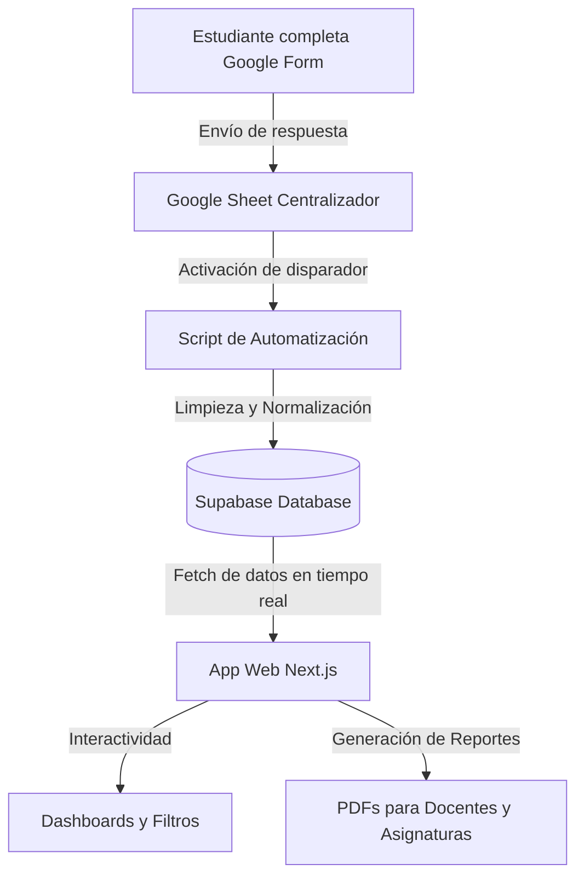

# Resumen de Funcionamiento: Proyecto de Evaluación Curricular - UCV

Este documento detalla el flujo de información y la arquitectura técnica del sistema de evaluación integral de unidades curriculares de la Escuela de Psicología de la Universidad Central de Venezuela.

## 1. El Ciclo de Datos

El sistema está diseñado para transformar las opiniones de los estudiantes en conocimiento accionable para la mejora académica.

## 2. Etapas del Proceso

### Fase 1: Recolección (Google Forms)
El proceso inicia cuando los estudiantes completan el instrumento de evaluación. Este formulario consta de **74 preguntas** que cubren:
* **Gestión de la Unidad Curricular**: Cumplimiento de cronogramas y programas.
* **Contenidos y Recursos**: Calidad y pertinencia de los materiales.
* **Evaluación**: Claridad y diversidad de procedimientos.
* **Desempeño Docente**: Actitud, dominio y pedagogía.
* **Autovaloración**: Compromiso del propio estudiante.

### Fase 2: Automatización y Almacenamiento (Apps Script & Supabase)
Para evitar la carga manual, se utiliza un script que:
1. Escucha cada nueva respuesta en la hoja de cálculo de Google.
2. Realiza una **limpieza de datos** (corrección de acentos, estandarización de nombres de docentes).
3. Inserta los registros en la tabla `datos_limpios` en **Supabase**, garantizando que la aplicación siempre tenga acceso a la información actualizada.

### Fase 3: Visualización e Inteligencia (App Web Next.js)
La aplicación web permite a los coordinadores y directivos explorar los resultados de manera intuitiva:
* **Resumen General**: Vista macro de los indicadores clave y demografía.
* **Filtros Jerárquicos**: Segmentación por Ciclo, Departamento, Cátedra y Asignatura.
* **Vista Detallada**: Ranking de docentes y asignaturas basado en el índice de satisfacción.
* **Reportes Individuales**: Generación automática de informes en PDF personalizados para cada docente o asignatura, listos para descargar y distribuir.

---

## 3. Especificaciones Técnicas
* **Frontend**: Next.js 15, React 19, Tailwind CSS (Diseño Premium).
* **Backend**: Supabase (PostgreSQL + Auth).
* **Gráficos**: Recharts para visualizaciones dinámicas.
* **Reportes**: @react-pdf/renderer para la creación de documentos PDF.
* **Animaciones**: Framer Motion para una experiencia de usuario fluida.

---
*Escuela de Psicología · Facultad de Humanidades y Educación · UCV*
